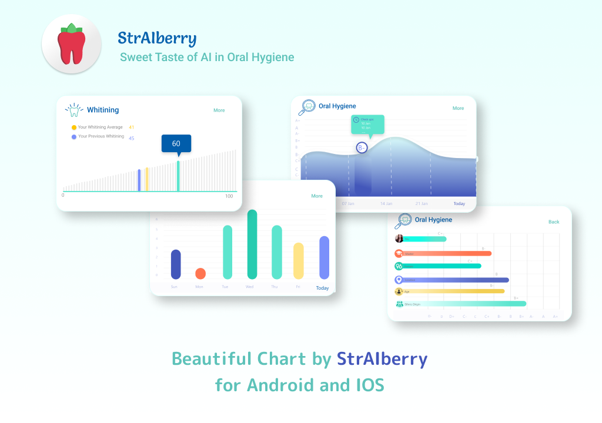
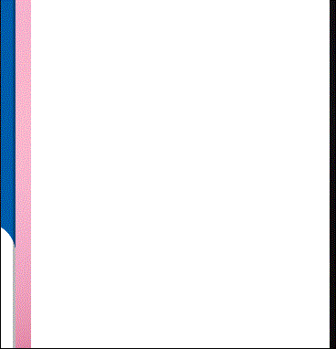
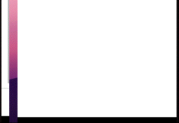
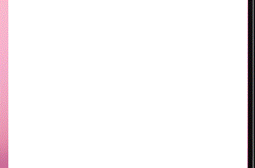

<div id="top"></div>

[](https://opensource.org/licenses/Apache-2.0)


<!-- PROJECT LOGO -->
<br />
<div align="center">
  <a href="https://github.com/othneildrew/Best-README-Template">
    
  </a>

  <h1 align="center">Straiberry Charts</h1>

  <p align="center">
    An awesome Chart library for android
    <br />
    <a href="https://www.straiberry.com/">Straiberry</a>
    ·
    <a href="https://github.com/STRAIBERRY-AI-INC/Straiberry-charts/issues">Report Bug</a>
    ·
    <a href="https://github.com/STRAIBERRY-AI-INC/Straiberry-charts/issues">Request Feature</a>
  </p>
</div>

<!-- GETTING STARTED -->
## Getting Started
### Adding dependecies
1. Add it in your root build.gradle at the end of repositories:
  ```sh
  	allprojects {
		repositories {
			...
			maven { url 'https://jitpack.io' }
		}
	}
  ```
2. Add the dependency
  ```sh
  	dependencies {
	        implementation 'com.github.STRAIBERRY-AI-INC:Straiberry-charts:1.1.0'
	}
  ```

### How it's work
There is four type of chart in this library:

1. Horizontal Bar Chart



```sh
  <com.straiberry.android.charts.view.HorizontalBarChartView
            android:id="@+id/horizontalBarChartViewBrushingDigit"
            style="@style/HorizontalChart"
            android:layout_width="310dp"
            android:layout_height="170dp"
            android:layout_marginBottom="10dp"
            android:clickable="false"
            android:focusable="false"
            app:chart_barsColorsList="@array/BrushingChartFilterColor"
            app:chart_barsRadius="17dp"
            app:chart_grid="full"
            app:chart_horizontal_y_label_type="fromZeroToSeven" or "isCharacter"
            app:chart_labelsSize="8sp"
            app:chart_spacing="13dp"
            app:layout_constraintLeft_toLeftOf="parent"
            app:layout_constraintRight_toRightOf="parent"
            app:layout_constraintTop_toTopOf="parent" />
```
Setup input data:
```sh
    /** Setup data for horizontal chart */
    private fun setupHorizontalChart() {

        val data = horizontalChartData(
            this, HorizontalChartXLabels(
                ContextCompat.getDrawable(this, R.drawable.ic_user)!!, "user",
                ContextCompat.getDrawable(this, R.drawable.ic_user)!!, "user",
                ContextCompat.getDrawable(this, R.drawable.ic_age)!!, "age",
                ContextCompat.getDrawable(this, R.drawable.ic_gender)!!, "gender",
                ContextCompat.getDrawable(this, R.drawable.ic_location)!!, "location",
                ContextCompat.getDrawable(this, R.drawable.ic_master)!!, "master",
            ), listOf(6F, 7F, 2F, 7F, 7F, 5F)
        )
        binding.horizontalBarChartViewBrushingDigit.animate(data)
    }
```

2. Bar Chart



```sh
 <com.straiberry.android.charts.view.BarChartView
            android:id="@+id/barChartViewBrushing"
            android:layout_width="300dp"
            android:layout_height="170dp"
            android:layout_marginBottom="10dp"
            android:clickable="false"
            android:focusable="false"
            app:chart_barsColorsList="@array/BrushingChartColor"
            app:chart_barsRadius="17dp"
            android:layout_marginTop="50dp"
            app:chart_grid="horizontal"
            app:chart_gridColorY="@color/gray400WithOpacity14"
            app:chart_labelsSize="8dp"
            app:chart_labelsXColor="@color/linkWithoutButton"
            app:chart_labelsYColor="@color/linkWithoutButton"
            app:chart_spacing="20dp"
            app:layout_constraintLeft_toLeftOf="parent"
            app:layout_constraintRight_toRightOf="parent"
            app:layout_constraintTop_toBottomOf="@id/horizontalBarChartViewBrushingCharacter" />
```

Setup input data:

```sh
private fun setupBarChart() {
        val currentDate = Date()
        val calendar = Calendar.getInstance()
        calendar.time = currentDate
        val data: ArrayList<HashMap<String, Int?>> = arrayListOf()
        
        repeat(7){
            data.add(hashMapOf(Pair(calendar.time.convertCurrentDateToChartDate(LINE_CHART_DATE_FORMAT),it+1)))
            calendar.add(Calendar.DATE, -1)
        }
        
        binding.barChartViewBrushing.animate(data.toChartData())
    }
```

3. Bar percent chart


```sh
<com.straiberry.android.charts.view.BarPercentChartView
            android:id="@+id/barPercentChartWhitening"
            style="@style/WhiteningChart"
            android:layout_width="match_parent"
            android:layout_height="140dp"
            android:layout_marginBottom="10dp"
            android:layout_marginTop="40dp"
            android:clickable="false"
            android:focusable="false"
            android:layoutDirection="ltr"
            app:chart_axis="x"
            app:chart_labelsSize="10sp"
            app:layout_constraintLeft_toLeftOf="parent"
            app:layout_constraintRight_toRightOf="parent"
            app:layout_constraintTop_toBottomOf="@id/linearChartViewOralHygiene" />
```

Setup input data:

```sh
private fun setupBarPercentChart() {
        // Prepare the tooltip to show on chart
        val pointTooltip = PointTooltip()
        pointTooltip.onCreateTooltip(binding.content)
        binding.barPercentChartWhitening.apply {
            tooltip = pointTooltip
            currentAverage = 20
            average = 50
            previousAverage = 30
            createBarPercent()
            disableTouchAndClick()
        }
    }
```

4. Line chart



```sh
<com.straiberry.android.charts.view.LineChartView
            android:id="@+id/linearChartViewOralHygiene"
            style="@style/OralHygieneChart"
            android:layout_width="325dp"
            android:layout_height="230dp"
            android:layout_marginBottom="8dp"
            android:layoutDirection="ltr"
            android:layout_marginTop="40dp"
            app:chart_grid="vertical"
            app:chart_gridEffect="dashed"
            app:chart_gridStrokeWidth="1dp"
            app:chart_labelsSize="8sp"
            app:chart_labelsXColor="@color/linkWithoutButton"
            app:chart_labelsYColor="@color/linkWithoutButton"
            app:layout_constraintLeft_toLeftOf="parent"
            app:layout_constraintRight_toRightOf="parent"
            app:layout_constraintTop_toBottomOf="@id/barChartViewBrushing" />
```

Setup input data:
You can refer to  <a href="https://github.com/STRAIBERRY-AI-INC/Straiberry-charts/blob/fdf3ba5795e30c587df5ca0991319bc85fa990a0/app/src/main/java/com/straiberry/android/charts/sample/MainActivity.kt#L76">sample</a> for setting up the Line chart
<br />
<br />
<br />
<br />

    Copyright 2022 Straiberry
    
    Licensed under the Apache License, Version 2.0 (the "License");
    you may not use this file except in compliance with the License.
    You may obtain a copy of the License at
    
      http://www.apache.org/licenses/LICENSE-2.0
    
    Unless required by applicable law or agreed to in writing, software
    distributed under the License is distributed on an "AS IS" BASIS,
    WITHOUT WARRANTIES OR CONDITIONS OF ANY KIND, either express or implied.
    See the License for the specific language governing permissions and
    limitations under the License.
<!-- MARKDOWN LINKS & IMAGES -->
<!-- https://www.markdownguide.org/basic-syntax/#reference-style-links -->
[contributors-shield]: https://img.shields.io/github/contributors/othneildrew/Best-README-Template.svg?style=for-the-badge
[contributors-url]: https://github.com/othneildrew/Best-README-Template/graphs/contributors
[forks-shield]: https://img.shields.io/github/forks/othneildrew/Best-README-Template.svg?style=for-the-badge
[forks-url]: https://github.com/othneildrew/Best-README-Template/network/members
[stars-shield]: https://img.shields.io/github/stars/othneildrew/Best-README-Template.svg?style=for-the-badge
[stars-url]: https://github.com/othneildrew/Best-README-Template/stargazers
[issues-shield]: https://img.shields.io/github/issues/othneildrew/Best-README-Template.svg?style=for-the-badge
[issues-url]: https://github.com/othneildrew/Best-README-Template/issues
[license-shield]: https://img.shields.io/github/license/othneildrew/Best-README-Template.svg?style=for-the-badge
[license-url]: https://github.com/othneildrew/Best-README-Template/blob/master/LICENSE.txt
[linkedin-shield]: https://img.shields.io/badge/-LinkedIn-black.svg?style=for-the-badge&logo=linkedin&colorB=555
[linkedin-url]: https://linkedin.com/in/othneildrew
[website-url]: https://www.straiberry.com/
[website-shield]: https://github.com/STRAIBERRY-AI-INC/Straiberry-charts/blob/main/image/empty_logo.png
[product-screenshot]: images/screenshot.png
